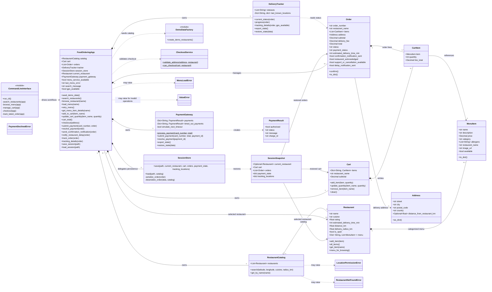

# Food Ordering App — Class Diagram

```mermaid
classDiagram
    direction LR

    class FoodOrderingApp {
        +RestaurantCatalog catalog
        +Cart cart
        +List~Order~ orders
        +DeliveryTracker tracker
        +SessionStore session_store
        +Restaurant current_restaurant
        +PaymentGateway payment_gateway
        +bool menu_service_available
        +str last_menu_error
        +str search_message
        +bool gps_available
        +seed_demo_data()
        +search_restaurants()
        +browse_restaurant(name)
        +load_menu(name)
        +retry_menu()
        +get_menu_item_details(name)
        +add_to_cart(item_name)
        +update_cart_quantity(item_name, quantity)
        +cart_total()
        +checkout(address)
        +submit_payment(card_number, order)
        +resolve_payment(order)
        +send_confirmation_notification(order)
        +notify_restaurant_delay(order)
        +track_order(order)
        +tracking_details(order)
        +save_session(path)
        +load_session(path)
    }

    class RestaurantCatalog {
        +List~Restaurant~ restaurants
        +search(latitude, longitude, cuisine, radius_km)
        +get_by_name(name)
    }

    class SessionStore {
        +save(path, current_restaurant, cart, orders, payment_state, tracking_locations)
        +load(path, catalog)
        -serialize_order(order)
        -deserialize_order(data, catalog)
    }

    class SessionSnapshot {
        +Optional~Restaurant~ current_restaurant
        +Cart cart
        +List~Order~ orders
        +dict payment_state
        +dict tracking_locations
    }

    class DemoDataFactory {
        <<module>>
        +create_demo_restaurants()
    }

    class CommandLineInterface {
        <<module>>
        +run_cli()
        -search_restaurants(app)
        -browse_menu(app)
        -manage_cart(app)
        -checkout(app)
        -track_latest_order(app)
    }

    class Restaurant {
        +str name
        +str cuisine
        +float rating
        +int estimated_delivery_time_min
        +float distance_km
        +float delivery_radius_km
        +bool is_open
        +Dict~String, List~MenuItem~~ menu
        +add_item(item)
        +all_items()
        +get_item(name)
        +menu_for_browsing()
    }

    class MenuItem {
        +str name
        +str description
        +Decimal price
        +str category
        +List~String~ allergens
        +str restaurant_name
        +str image_url
        +bool available
        +to_dict()
    }

    class Cart {
        +Dict~String, CartItem~ items
        +str restaurant_name
        +add_item(item, quantity)
        +update_quantity(item_name, quantity)
        +remove_item(item_name)
        +Decimal subtotal
        +clear()
    }

    class CartItem {
        +MenuItem item
        +int quantity
        +Decimal line_total
    }

    class Order {
        +str order_number
        +str restaurant_name
        +List~CartItem~ items
        +Address address
        +Decimal subtotal
        +Decimal delivery_fee
        +Decimal total
        +str status
        +str payment_status
        +int estimated_delivery_time_min
        +bool confirmation_notification_sent
        +bool restaurant_acknowledged
        +bool support_or_cancellation_available
        +bool delay_notification_sent
        +confirm()
        +to_dict()
    }

    class Address {
        +str street
        +str city
        +str postal_code
        +str country
        +Optional~float~ distance_from_restaurant_km
        +as_dict()
    }

    class PaymentResult {
        +bool authorized
        +str status
        +str message
        +str charge_id
    }

    class CheckoutService {
        +validate_address(address, restaurant)$
        +can_checkout(cart, restaurant)$
    }

    class PaymentGateway {
        -Dict~String, PaymentResult~ payments
        -Dict~String, PaymentResult~ timed_out_payments
        -bool simulate_next_timeout
        +process_payment(card_number, total)$
        +submit_payment(card_number, total, payment_id)
        +resolve_payment(payment_id)
        +export_state()
        +restore_state(data)
    }

    class DeliveryTracker {
        +List~String~ statuses
        -Dict~String, dict~ last_known_locations
        +current_status(order)
        +progress(order)
        +tracking_details(order, gps_available)
        +export_state()
        +restore_state(data)
    }

    class LocationPermissionError
    class RestaurantNotFoundError
    class PaymentDeclinedError
    class MenuLoadError
    class ValueError

    FoodOrderingApp "1" *-- "1" RestaurantCatalog : owns
    FoodOrderingApp "1" *-- "1" Cart : owns
    FoodOrderingApp "1" *-- "0..*" Order : manages
    FoodOrderingApp "1" *-- "1" DeliveryTracker : owns
    FoodOrderingApp "1" *-- "1" PaymentGateway : owns
    FoodOrderingApp "1" *-- "1" SessionStore : delegates persistence
    FoodOrderingApp ..> DemoDataFactory : seeds catalog
    CommandLineInterface ..> FoodOrderingApp : drives workflows
    SessionStore ..> SessionSnapshot : restores
    SessionSnapshot --> Restaurant : selected restaurant
    SessionSnapshot --> Cart : restored cart
    SessionSnapshot --> Order : restored orders
    FoodOrderingApp "0..*" --> "0..1" Restaurant : selected restaurant
    FoodOrderingApp ..> CheckoutService : validates checkout
    RestaurantCatalog "1" o-- "0..*" Restaurant : catalog
    Restaurant "1" *-- "0..*" MenuItem : categorized menu
    Cart "1" *-- "0..*" CartItem : entries
    CartItem --> "1" MenuItem : references
    Order "1" *-- "1..*" CartItem : order lines
    Order --> "1" Address : delivery address
    PaymentGateway ..> PaymentResult : creates
    DeliveryTracker ..> Order : reads status
    RestaurantCatalog ..> LocationPermissionError : may raise
    RestaurantCatalog ..> RestaurantNotFoundError : may raise
    FoodOrderingApp ..> ValueError : may raise for invalid operations
    FoodOrderingApp ..> MenuLoadError : may raise
```

Payment, menu availability, and courier tracking are simulated in-process; the
diagram does not imply integrations with external services.
